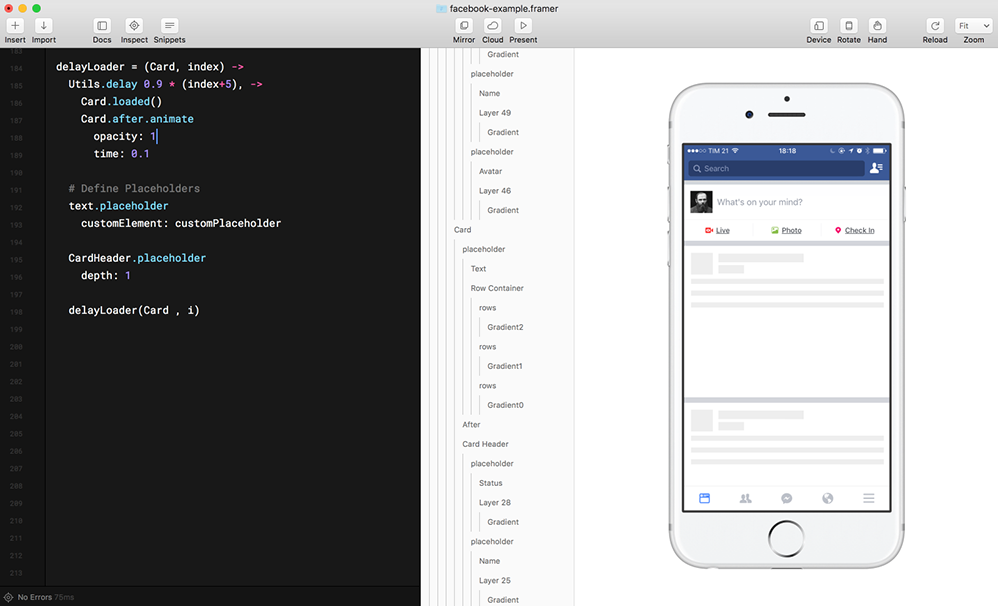

# Loading Placeholder

Choreography and free of side effects.



[See the demo](https://framer.cloud/NApWd/)

## How to use it

### Instalation

1. Download LoadingPlaceholder.coffee to your project's `/modules` directory
2. Add `Placeholder = require 'LoadingPlaceholder'` to the top of your code

### Start

Apply to any layer you want to show a placeholder.

```coffee
Placeholder = require 'LoadingPlaceholder'

YOURLAYER.placeholder()
```

You can set the placeholder to the parent layer and specify the `depth` property to replace just the children layers. For example:

```coffee
CardHeader = new Layer
  name: "Card Header"

avatar = new Layer
  name: "Avatar"
  parent: CardHeader

name = new Layer
  name: "Name"
  parent: CardHeader

CardHeader.placeholder
    depth: 1
```

In that example the Layers `avatar` and `name` recive a placeholder.

### Load the content

To show the content and trigger the entrance animation use the method `loaded()`:

```coffee
# You can trigger the animation to a particular layer
YOURLAYER.loaded()

# Or to all descendants layers that have a placeholder
CardHeader.loaded()
```

Another method is the shortcut `loadedall()`. It will search for all placeholder layers in current stage

```coffee
Placeholder = require 'LoadingPlaceholder'
placeholder.loadedAll()
```

### Overwrite default elements

If you want overwrite the deafult Placeholder Element or the Default Animation you can use this methods:

```coffee
Placeholder = require 'LoadingPlaceholder'

# Just for the specific layer
YOURLAYER.placeholder
    customElement: [function]
    customAnimation: [function]

# Apply global to all the placeholders
Placeholder.defaultElement = [function]
Placeholder.defaultAnimation = [function]
```

Overwrite using this follow functions:

```coffee
# Element
customPlaceholder = (layer) ->
  newPlaceholder = new Layer
    width: layer.width # var layer is the reference to your content layer
    height: layer.height

  return newPlaceholder

# Animation
custonAnimation = (layer, placeholder, delay) ->
  # Rewrite the states:
  # layer.states.placeholderIn
  # layer.states.placeholderOut
  # placeholder.states.placeholderOut
```
